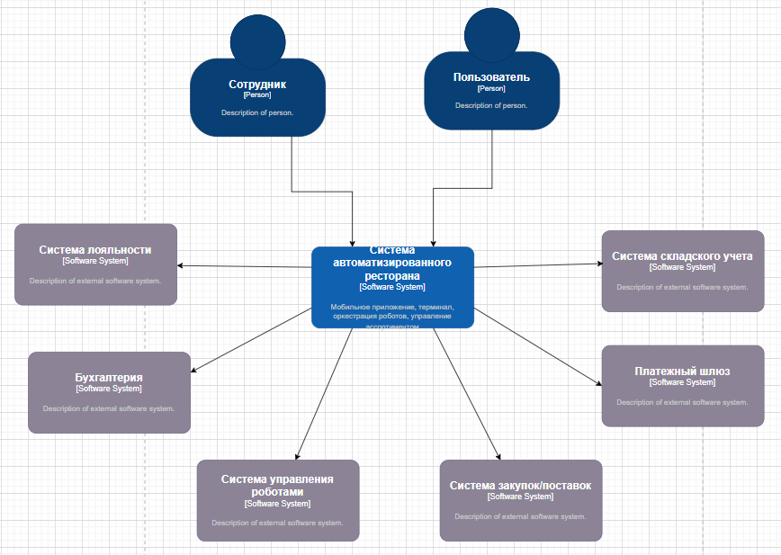
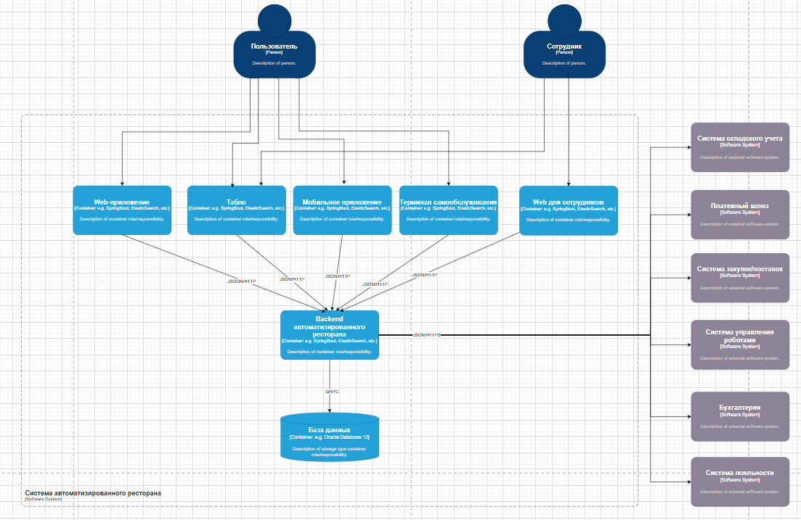
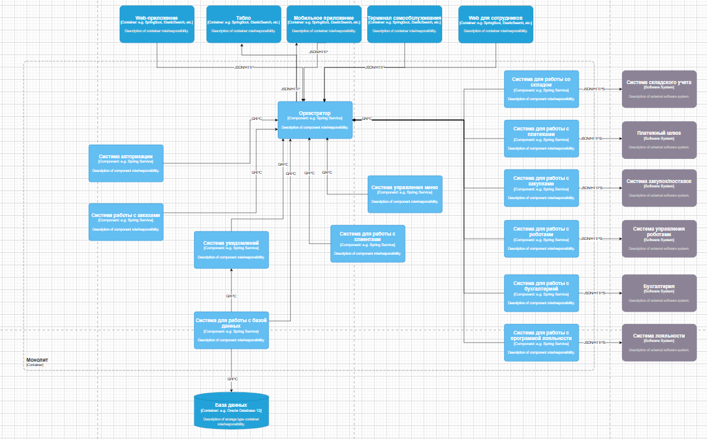

# Архитектура

## Обоснование выбора архитектурного стиля
Для реализации роботизированного ресторана выбран монолитный архитектурный стиль. Этот подход обусловлен рядом ключевых факторов:

- Ограниченное время разработки
> На создание MVP (минимально жизнеспособного продукта) выделен ограниченный срок времени - один год. Монолитная архитектура позволяет снизить количество времени, необходимого на проектирование и интеграцию отдельных сервисов, что дает возможность сосредоточиться на разработке основной функциональности системы и сократить общее время цикла разработки.

- Отсутствие необходимости в сложной масштабируемости
> На данном этапе проект не требует гибкой масштабируемости, характерных для микросервисной архитектуры. Основная функциональность заключается в управлении кухонными процессами и взаимодействии с клиентами в рамках ограниченного числа бизнес-функций, которые могут эффективно работать в рамках единой системы. 

- Оптимизация ресурсов и снижение технической сложности
> Монолитный стиль упрощает управление зависимостями и взаимодействие между модулями системы, что минимизирует технические риски и сложность при реализации MVP в ограниченный срок. Это также снижает требования к инфраструктуре и позволяет сэкономить ресурсы команды на развертывании, тестировании и поддержке системы, которые неизбежно возрастают в случае микросервисного подхода.

## Диаграмма контекста

## Диаграмма контейнеров

## Диаграмма компонентов

