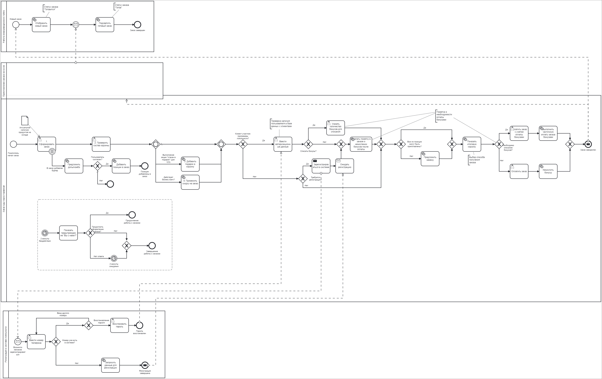

# Бизнес-требования

## Бизнес-цели
- Сокращение операционных расходов на 30% в течение одного года
- Создание первого в стране автоматизированного ресторана быстрого питания

## Бизнес-требования
- Необходимо создать систему автоматизированного ресторана
- Пользователями будут физические лица - простые посетители
- Продуктом можно пользоваться через веб, мобильное приложение или через терминал в ресторане
- Продукт должен включать управление роботами и систему оценки запасов, сроков хранения и заказа полуфабрикатов
- Необходимо обеспечить возможность оплатить через терминал, веб-приложение и мобильное приложение
- Проект должен уложиться в 100 млн рублей собственных средств

## Критерии успеха

- MVP должен быть выпущен через год от старта разработки
- MVP проекта должен обеспечить работающий ресторан, где автоматизированы технологические процессы с помощью внедрения роботов
- Каждый заказ должен быть обработан и выдан не более чем за 2 минуты
- Роботы должны поддержать выполнение 5000 заказов в сутки
- Система должна обеспечивать среднюю производительность в 1000 заказов в сутки
- Разрабатываемая система должна иметь интеграцию с существующими системами: система обслуживания кассовых аппаратов, система кадрового учета, бухгалтерия, система учета продуктов на складе
- В ресторане должно быть установлено 4 устройства для принятия заказов
- Система должна одновременно обрабатывать порядка 100 заказов

# Описание бизнес-процессов (что автоматизируем)

- Формирование заказа (тачпоинт или мобильное приложение)
- Просмотр корзины
- Предложение комбо/акций (если у клиента есть бургер, то нужно дополнительно предложить к заказу 
картошку и пирожок; при сумме заказа более 1500 рублей или наличии специального комбо, мы даем в
подарок фирменный стакан “робот и точка”; при этом, если заказ происходит в
будние дни с 10 до 16, то сделать скидку, т.к. это будет считаться бизнес-ланчем)
- Выбор способа получения заказа
- Авторизация/регистрация в системе лояльности
- Списание/начисление бонусов
- Оплата заказа
- Отображение заказа и его статуса на табло
- Ожидания и прекращение оформления заказа с помощью тачпоинта

