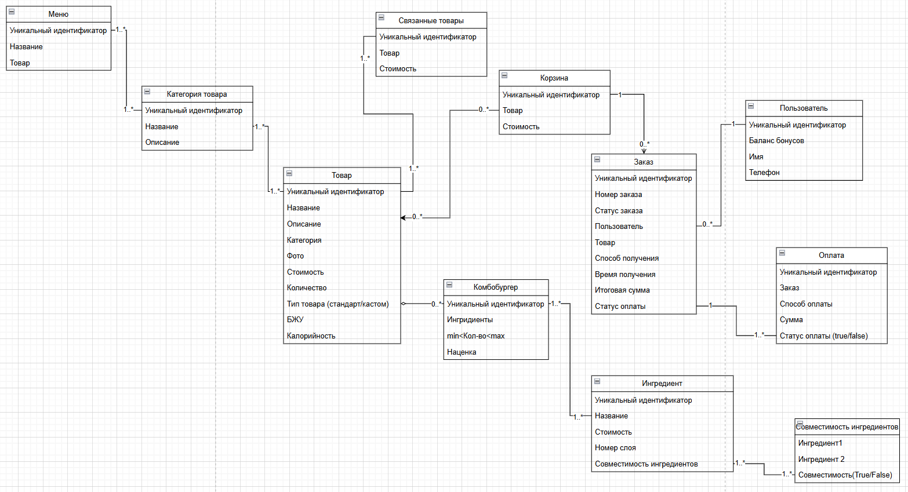
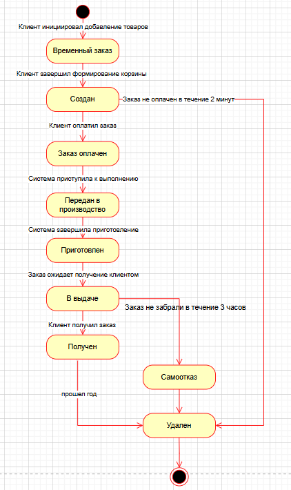
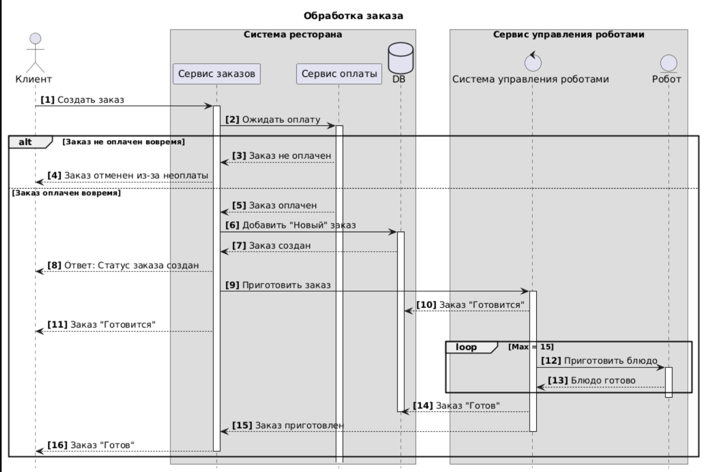

# Информационная модель

## Сущности предметной области
- **Меню** - набор блюд, объединенных по свойству (например, детское, сезонное и т.д.)
- **Категория товара** - набор блюд с общими признаками (например, напитки, бургеры, стартеры)
- **Товар** - блюдо ресторана
- **Связанные товары** - блюда, которые чаще всего покупают и которые больше всего подходят к выбранному блюду
- **Корзина** - набор блюд, который создал пользователь для дальнейшего заказа
- **Комбобургер** - бургер, собранный по желанию клиента
- **Ингредиент** - составная часть бургеры (например, булочка, котлета, помидор и т.д.)
- **Совместимость ингредиентов** - правила, по которым ограничивается совместное использование ингридиентов в бургере
- **Заказ** - набор блюд, за который клиент оплатил, и который необходимо приготовить и выдать 
- **Пользователь** - человек, использующий ресурсы ресторана
- **Оплата** - обмен денежных средств на выбранные блюда

## Диаграмма классов 

## Диаграмма состояний 

## Диаграмма последовательности 

