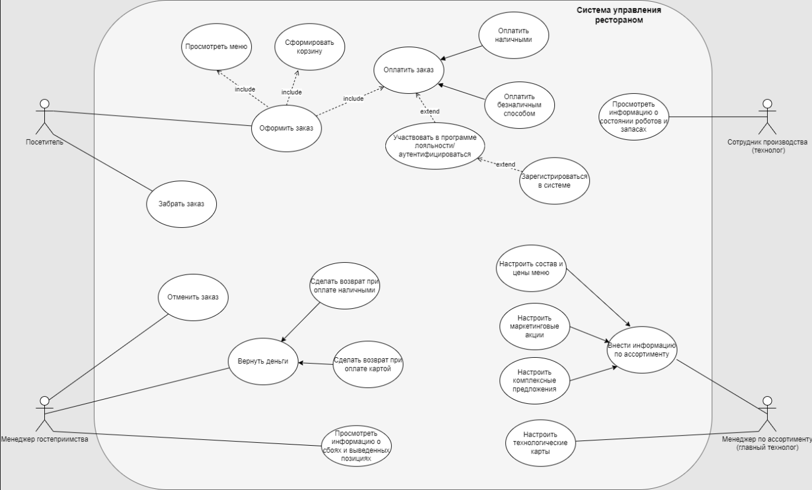

# Нефункциональные требования
- Ресторан должен обеспечить обслуживание всех посетителей в моменты пиков - при открытии, в обед, вечером и в выходные дни
- Каждый заказ должен быть обработан и выдан не более чем за 2 минуты. Цель системы - выполнять заказ за 1 минуту.
- Система должна обеспечивать среднюю производительность в 1000 заказов в сутки
- Допустимые потери при производстве в системе - не более 5%
- Разрабатываемая система должна иметь интеграцию с существующими системами:
    - система обслуживания кассовых аппаратов
    - система кадрового учета
    - бухгалтерия
    - система учета продуктов на складе
- Мобильное приложение для данного проекта должно быть написано на Flatter. Для Backend-разработки необходимо использовать - Java
- В рамках реализации данного проекта допустима минимальная пользовательская документация
- Данные, генерируемые роботами, должны храниться локально на роботах, чтобы не выделять централизованное хранилище
- В разрабатываемой системе должно применяться шифрование данных при передаче, а также логин и пароль для идентификации пользователя системы
- Система должна одновременно обрабатывать порядка 100 заказов
- В ресторане должно быть установлено 4 устройства для принятия заказов.
- Надежность системы должна составлять – 99%
- Отклик системы от тачпоинтов должен составлять – 1мс
- Система должна поддерживать пиковую нагрузку – 5000 заказов в сутки и 100 заказов одновременно с потенциалом роста до 10000 заказов одновременно от нескольких ресторанов
- Инфраструктура разрабатываемой системы должна быть – облачная

# UseCase - диаграмма
Основные функции системы представлены в виде UseCase диаграммы:

# User Story

## DoD для User Story:
- Реализация US соответствует Acceptance Criteria
- Код протестирован и отлажен
- Все необходимые одобрения получены (от всех заинтересованных стейкхолдеров)
- Функциональные тесты пройдены
- Минимально необходимая документация написана
- Продукт протестирован и утверждён заказчиком
- Продукт интегрирован с другими необходимыми системами и приложениями

В рамках проектной работы рассматривается только часть приложения, а именно приложение для заказа (мобильное+тачпоинт) и табло.

## Карта пользовательских историй для MVP
Система должна предоставлять посетителю ресторана возможность оформить заказ,
которая включает в себя возможность ознакомиться с меню, добавить интересующие
позиции в корзину, указать информацию “в зале” или “на вынос”, произвести оплату,
после чего посетителю выдается талон с номером заказа. Также при оформлении
заказа нужно учитывать, что если посетитель не зарегистрирован в нашей программе
лояльности, нужно предложить ему это сделать. После готовности заказа информация
об этом отображается на информационном табло, после чего посетитель предъявляет
талон и забирает свой заказ.
В рамках MVP планируется минимальный набор функций, обеспечивающий основные требования стейкхолдеров.

## Карта пользовательских историй для первого релиза
В первом релизе планируется доработать функции и сделать их более удобными и гибкими для пользователя.

