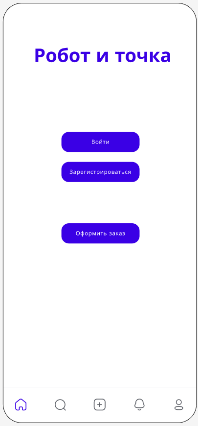
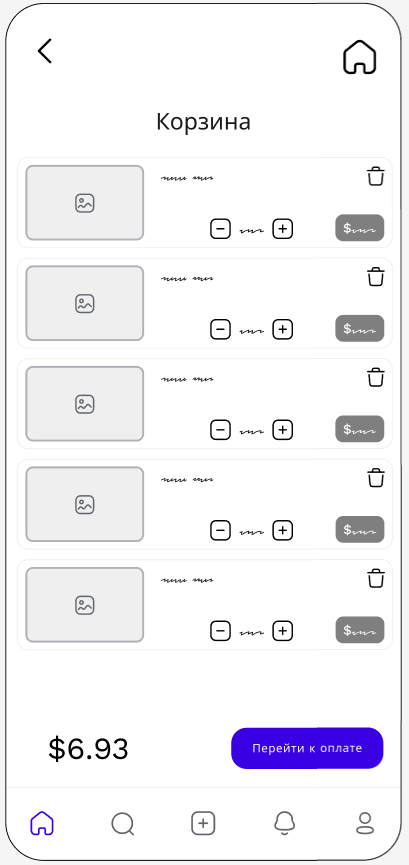
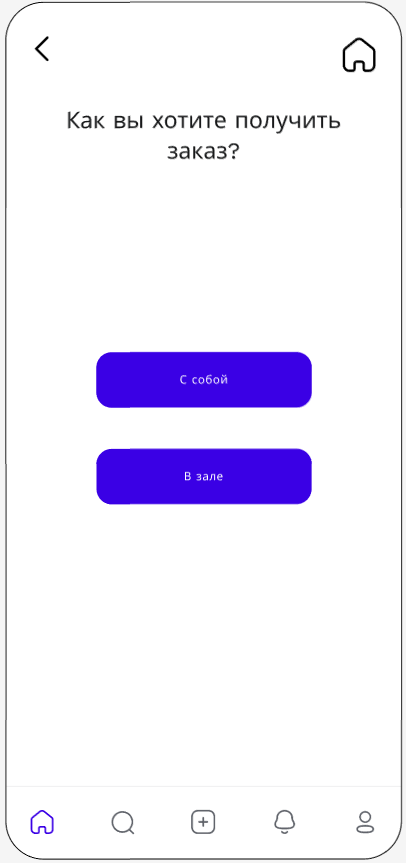
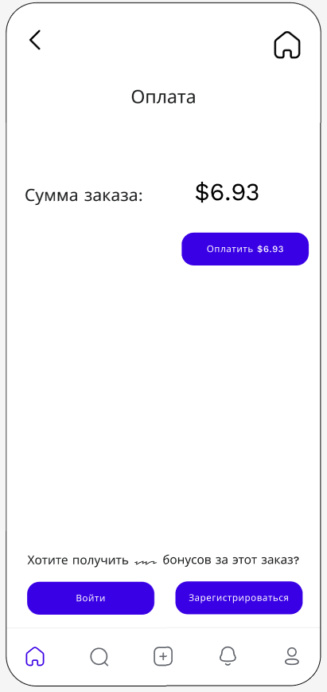
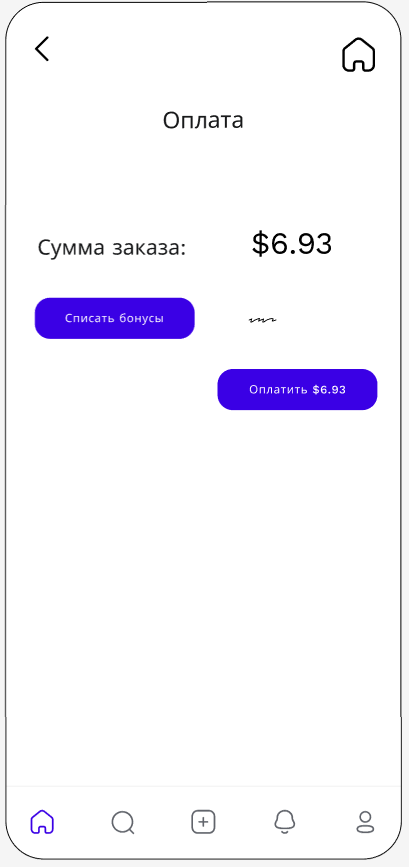
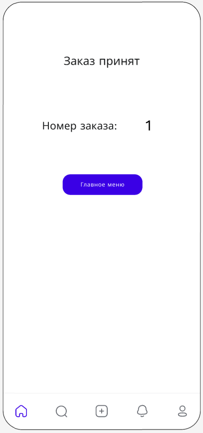
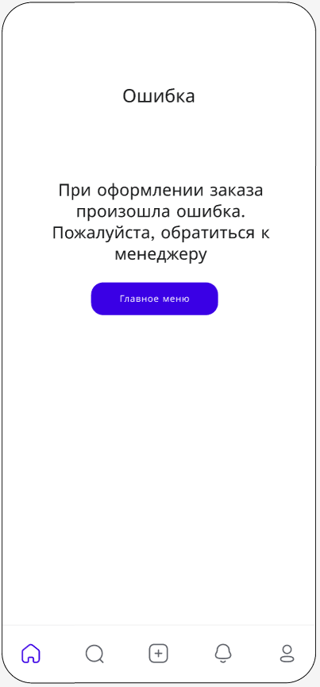

# Экранные формы приложения

## Главное меню

## Каталог категорий и блюд

## Проверка заказа

## Выбор опции "с собой" или "здесь"

## Оплата неавторизованного пользователя

## Оплата авторизованного пользователя

## Получение талона

## Ошибка

## Кликабельная версия

Прототип макетов доступен по [ссылке](https://www.figma.com/proto/gBLAioO4K1B3BrQOupuH3v/Wireframes-Kit-%5BFree%5D-(Community)?node-id=207-3147&node-type=canvas&t=D6CgF2iQBqRLf2qd-1&scaling=min-zoom&content-scaling=fixed&page-id=50%3A1963&starting-point-node-id=207%3A3147&share=1)