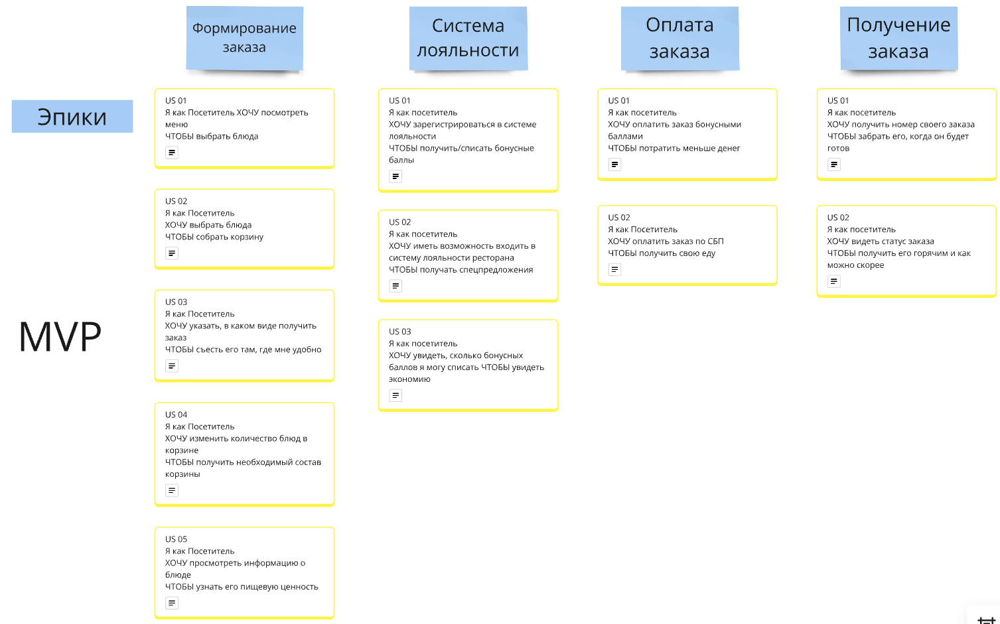
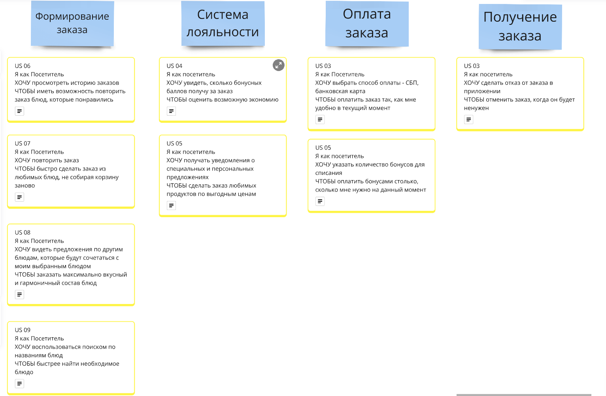

# User Story

## DoD для User Story:
- Реализация US соответствует Acceptance Criteria
- Код протестирован и отлажен
- Все необходимые одобрения получены (от всех заинтересованных стейкхолдеров)
- Функциональные тесты пройдены
- Минимально необходимая документация написана
- Продукт протестирован и утверждён заказчиком
- Продукт интегрирован с другими необходимыми системами и приложениями

В рамках проектной работы рассматривается только часть приложения, а именно приложение для заказа (мобильное+тачпоинт) и табло.

## Карта пользовательских историй для MVP

Система должна предоставлять посетителю ресторана возможность оформить заказ,
которая включает в себя возможность ознакомиться с меню, добавить интересующие
позиции в корзину, указать информацию “в зале” или “на вынос”, произвести оплату,
после чего посетителю выдается талон с номером заказа. Также при оформлении
заказа нужно учитывать, что если посетитель не зарегистрирован в нашей программе
лояльности, нужно предложить ему это сделать. После готовности заказа информация
об этом отображается на информационном табло, после чего посетитель предъявляет
талон и забирает свой заказ.
В рамках MVP планируется минимальный набор функций, обеспечивающий основные требования стейкхолдеров.

## Карта пользовательских историй для первого релиза

В первом релизе планируется доработать функции и сделать их более удобными и гибкими для пользователя.

